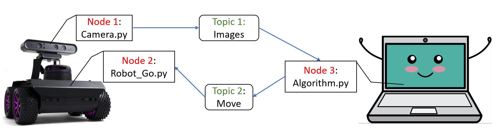
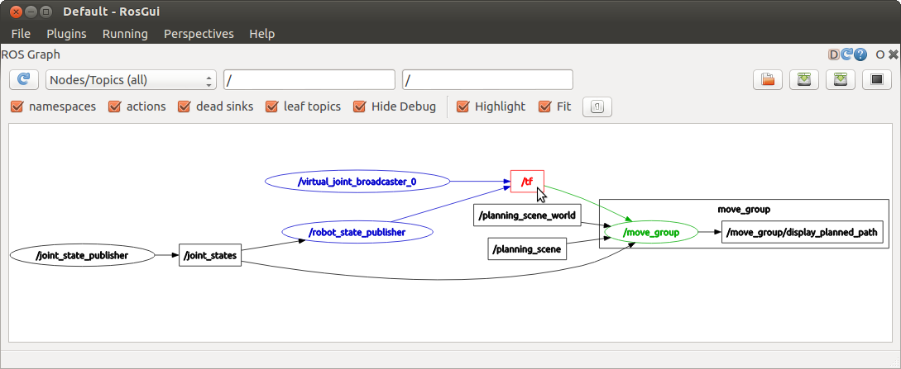

Introduction to ROS
====================
Overview
--------

`Robot Operating System`_ (ROS) is a collection of software frameworks for robot software developments. 
Although ROS is not an operating system, it provides services designed for a heterogeneous computer cluster and a majority of the packages are open source. 
One of its main advantages is that the client libraries (C++ and Python) allow nodes written in different programming languages to communicate. 
It is a powerful tool embedded with hardware abstraction, low-level device control, 
implementation of commonly used functionality, message-passing between processes, and package management.
While here we will only list the basic (key) components that might be used.

.. _Robot Operating System: http://wiki.ros.org/

Terminologies
-------------

In ROS, all resources (e.g., data from different sensors) are "Messages" of ``Nodes``. 
These "Messages"" could be accessed and transmitted among ``Nodes`` as ``Topics`` (as well as ``Services`` and ``Actions``). 

- ``Node``: An executable file, can publish or subscribe to a ``Topic``.
- ``Topic``: Nodes are communicating over a ``Topic``.
- ``Publish`` or ``Subscribe``: Broadcast or receive the "Message"

Their relation could be expressed in the following figure.

Writing a Publisher in Python
------------------------------

.. code-block:: python

    #!/usr/bin/env python3

    import rclpy
    from rclpy.node import Node

    from std_msgs.msg import String

    class Publisher(Node):

        def __init__(self):
            super().__init__('talker')
            self.publisher_ = self.create_publisher(String, 'chatter', 10)
            timer_period = 0.5  # seconds
            self.timer = self.create_timer(timer_period, self.timer_callback)
            self.i = 0

        def timer_callback(self):
            msg = String()
            msg.data = 'Hello World: %d' % self.i
            self.publisher_.publish(msg)
            self.get_logger().info('Publishing: "%s"' % msg.data)
            self.i += 1

    def main(args=None):
        rclpy.init(args=args)

        publisher = Publisher()

        rclpy.spin(publisher)

        # Destroy the node explicitly
        # (optional - otherwise it will be done automatically
        # when the garbage collector destroys the node object)
        publisher.destroy_node()
        rclpy.shutdown()

    if __name__ == '__main__':
        main()

Now we are going to explain each sentence of the sample script. Please read carefully and try to write your own code.

- This first line makes sure your code is executed as a python script.
.. code-block:: python

    #!/usr/bin/env python3
    
- As mentioned, "rclpy" is the python client library that needs to be imported if you are writting a ROS Node.

.. code-block:: python

    import rclpy
    from rclpy.node import Node

- This line imports a well-defined message type "String" that will be later used in "self.create_publisher".
You could find all information about a type of message by typing ``$message$ ros`` on google.
Most of the message types could be found at `std_msgs`_ or `common_interfaces`_.

.. _std_msgs: https://docs.ros.org/en/jazzy/p/std_msgs/
.. _common_interfaces: https://github.com/ros2/common_interfaces

.. code-block:: python

    from std_msgs.msg import String
    
- Initialize the node with name "talker".

.. code-block:: python

    super().__init__('talker')

- Declare a ``publisher`` that your ``node`` "talker" will publish messages to the ``topic`` "chatter".
The format of the message is defined as "String", i.e. the topic using the message type "String".
The "queue_size" limits the amount of queued messages if any subscriber is not receiving them fast enough.

.. code-block:: python

    self.publisher_ = self.create_publisher(String, 'topic', 10)

- The ``timer_callback`` is a fairly standard rclpy construct: calling a callback function after a certain period of time has passed.
  In this case, the "work" is a call to ``pub.publish(content)`` that publishes a string to our "chatter" ``topic``.
  Keep in mind that the "content" has format "String" (consistent with what we declared in "pub").
  Along with the string information we concat also the corresponding timestamp data, by storing it first in a "Header" variable.

.. code-block:: python

        timer_period = 0.5  # seconds
        self.timer = self.create_timer(timer_period, self.timer_callback)

    def timer_callback(self):
        msg = String()
        msg.data = 'Hello World: %d' % self.i
        self.publisher_.publish(msg)
        self.get_logger().info('Publishing: "%s"' % msg.data)
        self.i += 1

Writing a Subscriber in Python
------------------------------

.. code-block:: python

    #!/usr/bin/env python3

    import rclpy
    from rclpy.node import Node

    from std_msgs.msg import String

    class Subscriber(Node):

        def __init__(self):
            super().__init__('listener')
            self.subscription = self.create_subscription(
                String,
                'chatter',
                self.listener_callback,
                10)
            self.subscription  # prevent unused variable warning

        def listener_callback(self, msg):
            self.get_logger().info('Got: "%s"' % msg.data)

    def main(args=None):
        rclpy.init(args=args)

        subscriber = Subscriber()

        rclpy.spin(subscriber)

        # Destroy the node explicitly
        # (optional - otherwise it will be done automatically
        # when the garbage collector destroys the node object)
        subscriber.destroy_node()
        rclpy.shutdown()

    if __name__ == '__main__':
        main()

- Declare a ``subscriber`` that your ``node`` "listener" will subscribe to messages from the ``topic`` "chatter".
  The format of the message is defined as "String" and the received data are stored in the "callback" function. spin() keeps python from exiting until this node is stopped

.. code-block:: python

    self.subscription = self.create_subscription(
        String,
        'topic',
        self.listener_callback,
        10)

    rclpy.spin(minimal_subscriber)

The code for ``Subscriber`` is similar to ``Publisher``. The main difference is the ``Subscriber`` will call a "callback" function when new messages are received. 
Note that the "callback" is a void function, i.e. it can't return anything. 
So if we want to utilize the received message, we will introduce the Python "Classes". It provides a means of bundling data and functionality together. 
Here we will give a simple example to show how to combine ``Publisher`` with ``Subscriber`` and how to commit data collected in "callback" function through the script.
(Note the code here is only for explaining the usage but make no sense in terms of control.)

.. code-block:: python

    #!/usr/bin/env python3

    import rclpy
    from rclpy.node import Node

    from nav_msgs.msg import Odometry
    from geometry_msgs.msg import Twist, Pose2D

    class Bot(Node):

        def __init__(self):
            super().__init__('bot_control')
            # Initialization
            self.N = 20
            self.i = 0
            self.done = False
            self.vel = Twist()
            self.pose = Pose2D()

            self.pub = self.create_publisher(Twist, '/cmd_vel', 10)
            self.sub = self.create_subscription(Odometry, '/odom', self.odom_callback, 10)
            self.timer = self.create_timer(0.1, self.timer_callback)  # 10 Hz

        def timer_callback(self):
            if self.i < self.N:
                self.controller(self.pose)
                self.i += 1
            else:
                self.timer.cancel()
                self.shutdown()
                self.done = True

        def controller(self, state):
            self.vel.linear.x = -state.x
            self.vel.angular.z = 0.0
            self.pub.publish(self.vel)

        def odom_callback(self, msg):
            self.pose.x = msg.pose.pose.position.x  # Please check the definition of message type "Odometry" to see why we could get the content in this way.
            self.pose.y = msg.pose.pose.position.y

        def shutdown(self):
            self.get_logger().info('stop')
            stop_vel = Twist()
            stop_vel.linear.x = 0.0
            stop_vel.angular.z = 0.0
            self.pub.publish(stop_vel)

    def main(args=None):
        rclpy.init(args=args)

        bot = Bot()

        while rclpy.ok() and not bot.done:
            rclpy.spin_once(bot)

        bot.destroy_node()
        rclpy.shutdown()

    if __name__ == '__main__':
        main()

In the script above, we show how to communicate with a robot and design a feedback controller for it using ROS. 
Firstly, we do initialization and propagate the system in the ``__init__`` function. 
Once we initialize the ``Subscriber``, the data in ``odom_callback`` will keep updating its information according to the new received data from topic ``/odom``. 
So the variable ``pose`` will also keep updating. 
At every 0.01s (10 hz), when we run the ``controller`` function, it can use current ``pose`` as feedback information for control.
Then the control inputs are published to topic ``/cmd_vel``, which will be subscribed by the robot as current command.

Using ``rqt_graph``
-----------------------------

- ``rqt_graph`` is a good tool to clarify the relations among topics and nodes by providing a ROS communication graph. 
You could check whether your communication algorithm works or not. To use it, just open a new terminal and type ``rqt_graph``, an example is shown as follows.

Frequently-used Commands
------------------------

- ``ros2 launch $package_name$ $file.launch.py$``: is for easily launching multiple ROS nodes as well as setting parameters.
- ``ros2 node list``: lists all active nodes that are currently running.
- ``ros2 node info $node$``: show information of the node, e.g., publications; subscriptions.
- ``ros2 topic list``: print information about active topics
- ``ros2 topic echo $topic$``: print message to screen.
- ``ros2 topic type $topic$``: print topic type (message type)
- ``ros2 run $package$ $executable$``: Allows you to run an executable in an arbitrary package from anywhere without having to give its full path

Communication with Gazebo Simulator
-----------------------------------
`Gazebo`_ is an open-source 3D robotics simulator. It offers the ability to accurately and efficiently simulate populations of robots in complex indoor and outdoor environments.
You could use it for rapidly and safely testing your algorithms, designing robots and collecting or training a large amount of data using realistic scenarios. 
Generally speaking, if you use an existing robot, you could find its model in their documents. 
If you are building your own robot and want to simulate it in Gazebo, please look at the `tutorial`_.

.. _Gazebo: https://gazebosim.org/docs/latest/tutorials/
.. _tutorial: https://docs.ros.org/en/jazzy/Tutorials/Advanced/Simulators/Gazebo/Gazebo.html

..
    We show an example that describes how to use ROS with Gazebo where it simulates the `ROSbot`_ (a differential-drive wheeled robot). You could find the video at 
    ``iLearn -> EE175A(001) Fall2020 -> YuJa -> SHARED -> All Channels -> EE_175A_001_20F -> ee175Demo_all``.

    .. _ROSbot: https://husarion.com/manuals/rosbot-manual/#ros-api

Resources
---------
- Finding answers to your problems: https://robotics.stackexchange.com
- Cheatsheets: https://github.com/ubuntu-robotics/ros2_cheats_sheet/blob/master/cli/cli_cheats_sheet.pdf
