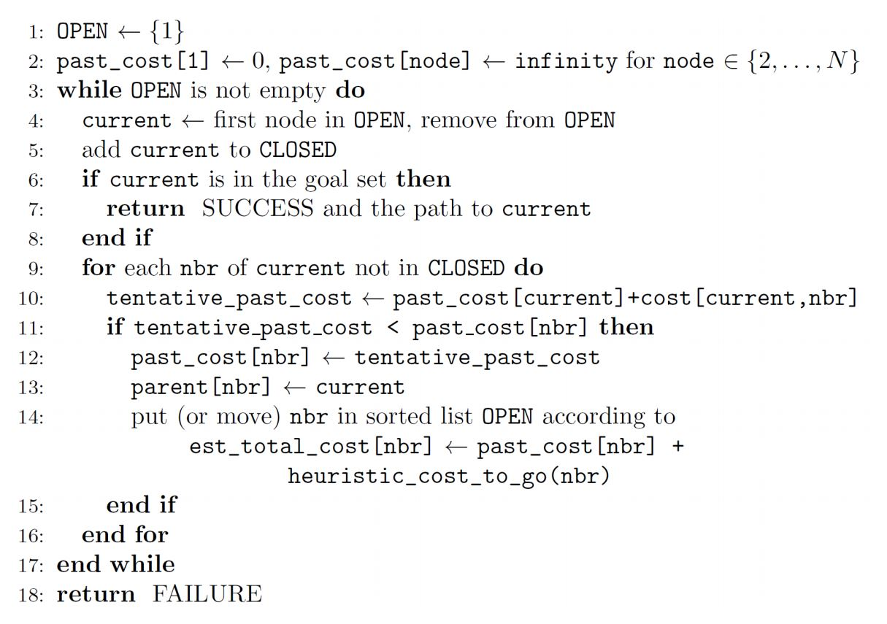

Lab 6: Motion Planning and Trajectory Generation
======================

Motion Planning
--------

We assume a grid map is given with some grids marked as obstacles.
The task is to apply A* algorithm to find an optimal path from the start grid to the goal grid
without colliding with obstacles. 
You can use Manhattan distance or Euclidean distance as the heuristic function.
(Other admissible heuristic functions should also work.)
No diagonal movement is allowed (i.e. use 4-connected graphs). 

Please refer to the lecture slides for more details. 
The pseudocode is provided at the end of this page.

Submission
----------

#. Submission: Group submission via Gradescope

#. Demo: not required

#. Due time: 11:59, May 30, Friday

#. Files to submit:

   - lab6_report.pdf
   - motion_planning.py

#. Grading rubric:

   + \+ 50%  Clearly describe your approach and explain your code in the lab report.
   + \+ 50%  Implement A* algorithm and pass all test cases.
   + \- 15%  Penalty applies for each late day. 

Autograder (1) for Motion Planning
----------

For each A* path computed, the autograder will check the following conditions. 

#. The returned path should be a Python list, and each element in the list should be a 2-tuple.
   (Will discuss this data type soon.)

#. The path should not collide with any obstacle. 

#. The path should contain the goal grid but not the start grid.

   - For example, the path from (0, 0) to (2, 2) should be [(1, 0), (1, 1), (2, 1), (2, 2)]
   - This is a convention in grid-based motion planning, such that when iterating over the list,
     it can lead the robot to the goal.

#. The path should have 4-connectivity from the first element to the last. 

   - In other words, at each step, from one grid to the next, 
     the robot can move in only one of the four directions 
     [1, 0], [-1, 0], [0, 1] or [0, -1]. No diagonal movement is allowed.
   - The start grid and the first element in the path should also have 4-connectivity.

Sample Code
-----------

- Open a new terminal and go to your ``ee106s25`` package. 
  We will create a new python script.

  .. code-block:: bash

    roscd ee106s25/src
    touch motion_planning.py
    gedit motion_planning.py

- Please copy and paste the following code.

    .. code-block:: python
    
        def neighbors(current):
            # define the list of 4 neighbors
            neighbors = []
            return [ (current[0]+nbr[0], current[1]+nbr[1]) for nbr in neighbors ]

        def heuristic_distance(candidate, goal):
            pass

        def get_path_from_A_star(start, goal, obstacles):
            # input  start: integer 2-tuple of the current grid, e.g., (0, 0)
            #        goal: integer 2-tuple  of the goal grid, e.g., (5, 1)
            #        obstacles: a list of grids marked as obstacles, e.g., [(2, -1), (2, 0), ...]
            # output path: a list of grids connecting start to goal, e.g., [(1, 0), (1, 1), ...]
            #   note that the path should contain the goal but not the start
            #   e.g., the path from (0, 0) to (2, 2) should be [(1, 0), (1, 1), (2, 1), (2, 2)] 
            return path

- To test the algorithm, you can use the following script and change test cases as you want. 
- 
    .. code-block:: python

        from motion_planning import get_path_from_A_star

        if __name__ == '__main__':
            start = (0, 0) # this is a tuple data structure in Python initialized with 2 integers
            goal = (-5, -2)
            obstacles = [(-2, 1), (-2, 0), (-2, -1), (-2, -2), (-4, -2), (-4, -3)]
            path = get_path_from_A_star(start, goal, obstacles)
            print(path)

- An example of the grid map and the corresponding A* path is shown below.

  .. image:: pics/A_star_before.png
    :width: 48%
  .. image:: pics/A_star_after.png
    :width: 48%

A* Pseudocode
-------------

You may refer to the pseudocode shown below.

Overview
--------

In this lab, we will focus on how to generate **smooth trajectories** using polynomial time scaling. 

Specifically, the task is to implement the 3rd order polynomial time scaling and apply it
for each segment of the trajectory and for both x and y coordinates. 
Waypoints will be provided in the sample script, 
and should be included in the boundary/continuity constraints when generating trajectories.

Preview: Next time we will learn how to use A* algorithm to search for the waypoints, when a map is given.

Submission
----------

#. Submission: group submission via Gradescope. **Important**: If any of the two team members have ROS Kinetic installed, it is **highly recommended** to setup the code on this computer and not on the M1/M2 computer. The main reason for this is that during the final Lab 8, the real turtlebots have ROS Kinetic installed so there will be fewer code modifications if you develop your ROS nodes for ROS Kinetic.

#. Demo: not required

#. Due time: 11:59pm, Nov 27, Monday

#. Files to submit:

   - lab6_report.pdf (please include the plot of trajectory)
   - trajectory_generation.py

#. Grading rubric:

   + \+ 30%  Clearly describe your approach and explain your code in the lab report.
   + \+ 20%  Plot the trajectory and discuss the results under different parameters.
   + \+ 50%  Pass all waypoints using 3rd order polynomial trajectories.
   + \- 15%  Penalty applies for each late day. 

Autograder
----------

All code submissions will be graded automatically by an autograder uploaded to Gradescope.
The scripts will be tested on a Ubuntu cloud server using a similar ROS + Gazebo environment.
The grading results will be available in a couple of minutes after submission.

Testing parameters are as follows. 

#. The tolerance for distance error is set to 0.1m.

   - For example, passing point [3.96, 3.94] is approximately equivalent to passing point [4, 4].

#. The autograder will check 8 out of 14 waypoints and the last stopping point [0, 0].

   - They are [0.5, 0], [0.5, -0.5], [0.5, 0.5], [1, 0], [1, -0.5], [1, 0.5], [1.5, -0.5], [1.5, 0.5]. 

#. The time limit is set to 5 mins.

Sample Code
-----------

- Open a new terminal and go to your ``ee144f23`` package. 
  We will start from a new python script.

  .. code-block:: bash

    roscd ee144f23/scripts
    touch trajectory_generation.py
    gedit trajectory_generation.py

- Please copy and paste the following code. If both of the team members have an M1/M2 computer, please follow the corresponding approach by replacing the Python version with ''python3'' and the ROS Topic with "cmd_vel".

  .. literalinclude:: ../scripts/trajectory_generation.py
    :language: python

- This script is following the same structure as the one used in Lab 3, 
  except for the changes under ``run`` function.

- You need to complete the ``move_to_point`` function in this code,
  and make sure the robot can pass all the waypoints. 
  The ``polynomial_time_scaling_3rd_order``
  function is provided for your information only. You may or may not use it.

Polynomial Time Scaling
-----------------------

Suppose that we have figured out a path from point A to point B. 
The question is how fast the robot should follow the path (i.e. where it should be at each moment). 
This process of generating intermediate points (each associated with a time stamp) is called 
time scaling, or trajectory generation at large. 

Recall that sending constant velocity commands from the very beginning would assume
the robot can have infinite large acceleration at the first moment, which is impractical.
Therefore, we would like to have a smooth trajectory that can best fit robot kinematics. 

On the other hand, polynomial functions are smooth (infinitely differentiable) functions that can provide us
smooth trajectories at all orders (position, velocity, acceleration, the derivative of acceleration, and so on).
To this end, polynomial time scaling becomes a good choice to generate trajectories. 

Suppose that we plan to move from point A to point B in ``T`` seconds by following a straight line.
Then where the robot should be at each moment can be described by the following function.
It provides the position of the robot ``x(t)`` at any given time ``t``.

.. math::

  \begin{equation}
  x(t) = a_{0} + a_{1} t + a_{2} t^{2} + a_{3} t^{3}, t \in [0, T]
  \end{equation}

Accordingly, the expected velocity at any time ``t`` can be described 
by the derivative of this polynomial function.

.. math::

  \begin{equation}
  \dot{x}(t) = a_{1} + 2 a_{2} t + 3 a_{3} t^{2}, t \in [0, T]
  \end{equation}

The key is to figure out the coefficients of this function **for each and every trajectory segment**
and **for both x and y coordinates**. 
In other words, coefficients can vary from segment to segment, 
as each segment should adopt different initial and terminal conditions to best fit its needs.

Fortunately, we can formulate this problem into a linear system of equation as follows,
where :math:`x_0, x_T, \dot{x}_0, \dot{x}_T` are initial/terminal position/velocity respectively. 
  
.. math::

  \begin{equation}
  \left[\begin{array}{c}
  x_{0} \\
  x_{T} \\
  \dot{x}_{0} \\
  \dot{x}_{T}
  \end{array}\right]=\left[\begin{array}{cccc}
  0 & 0 & 0 & 1 \\
  T^{3} & T^{2} & T & 1 \\
  0 & 0 & 1 & 0 \\
  3 T^{2} & 2 T & 1 & 0
  \end{array}\right]\left[\begin{array}{l}
  a_{3} \\
  a_{2} \\
  a_{1} \\
  a_{0}
  \end{array}\right]
  \end{equation}

To solve this equation of the form :math:`x = Ta`, we can simply take the advantage of the inverse matrix
and have the solution :math:`a = T^{-1}x`. 
Once the coefficients are known, the position and the velocity at each moment can be obtained by evaluating 
the function :math:`x(t)` and :math:`\dot{x}(t)` at :math:`t = 0, 0.1, 0.2, ..., T`. 
(This is an example of running at 10Hz where the time interval is 0.1s.)

Finally, a PID controller (introduced in Lab 3) can be applied to track the desired position and velocity 
at each moment. To closely track the trajectory, the parameter ``Kp`` can take a larger value.
As before, it is possible to only track the orientation by the PID controller and 
simply set the linear velocity to be the magnitude (i.e. :math:`v = \sqrt{v_x^2 + v_y^2}` ). 
Note that the orientation ``setpoint`` in this lab is changing all the time as the robot follows the trajectory 
(as opposed to a fixed setpoint in Lab 3). 

So far we have introduced the basic steps to solve for a polynomial time scaling problem.
The following are three final remarks regarding the selection of parameters.

#. Two ways to pick the time interval ``T``
   (this is one of the drawbacks of this approach; you have to specify ``T`` ahead of time)

   - Fixed time interval for all segments.

   - Pick a preferred average speed, then determine ``T`` based on the distance to travel.

#. Notes on boundary conditions and continuity constraints
   
   - It is better to look at not only the current waypoint, but also the next one.
     Because normally the next waypoint can provide useful information to 
     help determine how to pass the current waypoint. 
     
   - For example, when moving from point A to point B by following a straight line, 
     knowing that point C is to the right of point B is a good indicator to curve the 
     current trajectory a bit more, such that this turning behavior can be evenly distributed 
     in the trajectory and avoid a sharp turn at point B.

   - In practice, the magnitude of the velocity can be set to a preferred speed, and
     the direction of the velocity of passing point B can be set to the direction from point A to point C.

#. Discussion on the numerical stability of polynomial functions

   - It is possible to use a continuous timeline for all trajectories 
     (i.e. :math:`[0, T_1]` for the first segment, :math:`[T_1, T_2]` for the second, and so on).
     However, this approach is not numerically stable, especially when the order of the polynomial is higher.

   - For example, in a 7th order polynomial function, as :math:`T` grows larger, 
     to make the term :math:`a_7 t^7` reasonably small, 
     the parameter :math:`a_7`  will have to be at the level of :math:`10^{-10}` or even smaller. 
     
   - Conclusion: we recommend using relative time scale :math:`[0, T]` for all segments (i.e. reset timing every time).

Visualization
-------------

- You can reuse the visualization python script provided in Lab 3 to plot the trajectory.
  Remember to adjust the limit on x and y axes and **include the plot in the lab report**. 

- An example of the trajectory is provided as follows.
  It is a bit overshooting. You can do better :)

Programming Tips Motion Planning
----------------

#. Review of some use cases of Python List

   - ``path = list()`` or ``path = []`` creates an empty list.
   - ``path.append()`` appends a new element to the end of the list.
   - ``path.pop()`` removes (and returns) the element at the specified position.
   - ``path.sort()`` sorts the list ascending by default.
   - ``path.reverse()`` reverses the sorting order of the elements.

#. Tuple data type in Python

   - In Python, [0, 0] is a list with 2 elements, while (0, 0) is a tuple with 2 elements (named 2-tuple).
   - [[0, 1], [1, 1], [1, 2]] is a list and its elements are also lists,
     while [(0, 1), (1, 1), (1, 2)] is a list and its elements are tuples.
   - A path should be a list with multiple elements, and each element is a 2-tuple. 

#. Dictionary data type in Python

   - ``d = dict()`` or ``d = {}`` creates an empty dictionary. 
   - We have to use tuple in this lab because tuple is 
     `hashable <https://stackoverflow.com/questions/14535730/what-does-hashable-mean-in-python>`_,
     and hence can be used in a dictionary.
   - The operation ``d[start] = 0`` is invalid if ``start`` is a list 
     and valid if ``start`` is a tuple.

#. Comparison over List, Tuple and Dictionary

   - ``List`` is ordered and changeable. Allows duplicate members.
   - ``Tuple`` is ordered and unchangeable. Allows duplicate members.
   - ``Dictionary`` is unordered, changeable and indexed. No duplicate members.
